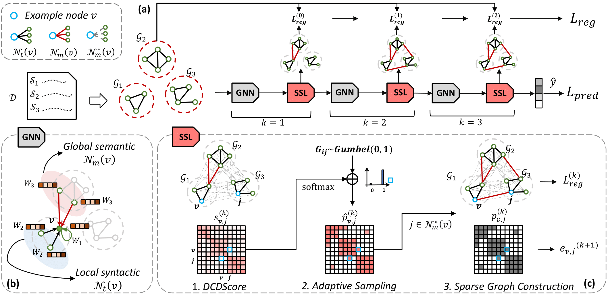

# Sparse Structure Learning via Graph Neural Networks for inductive document classification [[arXiv]](https://arxiv.org/abs/2112.06386)

<p align="center">
  
</p>


## About data
We use the same benchmark datasets that are used in Yao, Mao, and Luo 2019, 
where we follow the same train/test splits and data preprocessing for MR, Ohsumed and 20NG datasets as Kim 2014; Yao, Mao, and Luo 2019. 
Thanks for their work.

For R8 and R52 datasets, they are only provided by a preprocessed version that lack punctuations and do not have explicit sample names. 
Since we use documents with sentence segmentation information to construct graph, we re-extract the data from original Reuters-21578 dataset.

You can download the dataset [*here*](http://disi.unitn.it/moschitti/corpora/Reuters21578-Apte-115Cat.tar.gz): 

1. re-extract R8 and R52 datasets.
    ```
    python re-extract_data/mk_R8_R52.py --name R8
    ```
2. remove words.
    ```
    python remove_words.py --name R8
    ```
---

##### *About path*
*To run the code, you should change `Your_path=/data/project/yinhuapark/ssl/` to your own path.*

---
## Make graph dataset

1. create co-occurrence pairs of each documents. 
    ```
    python ssl_make_graphs/create_cooc_document.py --name R8 
    ```
2. construct graphs of each documents in InMemoryDatset.
    ```
    python ssl_make_graphs/PygDocsGraphDataset.py --name R8 
    ```

## Train
```
python ssl_graphmodels/pyg_models/train_docs.py --name R8
