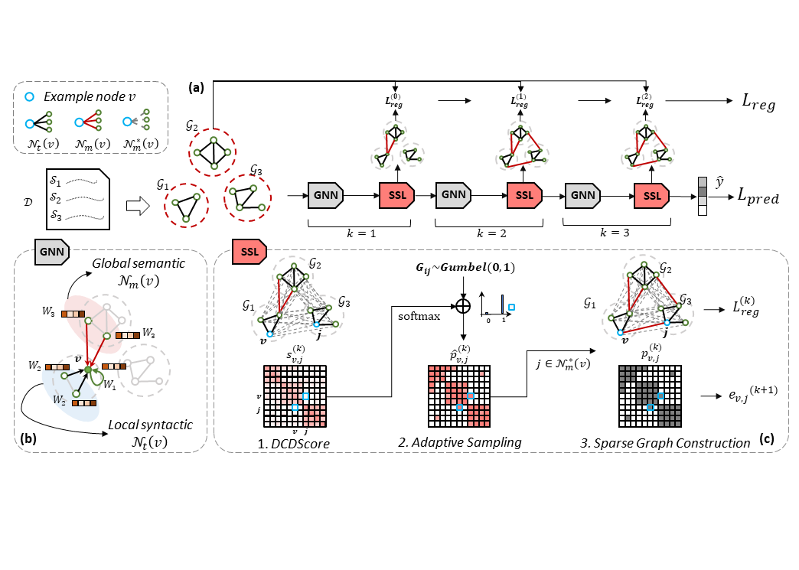

# Sparse Structure Learning via Graph Neural Networks for inductive document classification

<p align="center">
  
</p>


## Make graph dataset!

1. create co-occurrence graph for datasets. 
    ```
    python ssl_make_graphs/create_cooc_document.py --raw_path SOURCEPATH --pre_path TARGETPATH --task DATASET --partition TRAINorTEST --window_size SIZE
    ```

2. construct in memory graph datsets.
    ```
    python ssl_make_graphs/PygDocsGraphDatset.py --raw_path SOURCEPATH --task DATASET 
    ```


## Reproduce! 

    python ssl_graphmodels/pyg_models/train_docs.py

